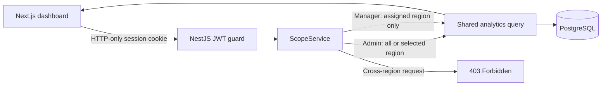

# CourseScope

CourseScope is a full-stack managerial dashboard for an online learning platform. It converts nested enrollment data into a relational PostgreSQL model, authenticates three demo roles, and applies region scope in the NestJS query path so a manager cannot retrieve another region's data even by calling the API directly.

## What it shows

- One shared revenue-by-category bar chart powered by `GET /analytics/dashboard` for every role.
- An Admin region filter for All, East, North, and South.
- North and South managers locked to their assigned region in the backend.
- A role-scoped category health view that compares completion, drop-off, and ratings instead of treating revenue as the only success measure.

## Request flow



The browser never decides authorization. It only presents the regions returned for the logged-in user. `ScopeService` derives the effective region before either analytics query is built; a manager's cross-region request fails with `403`.

## Stack

- Node.js 20+
- pnpm 10.30.1
- Next.js 16 and React 19
- NestJS 11, TypeORM, and PostgreSQL 17
- Native CSS bars for the chart, avoiding a chart dependency for four values

## Run from clone

```bash
cp .env.example .env
pnpm install
pnpm db:up
pnpm db:migrate
pnpm db:seed
pnpm dev
```

Open [http://localhost:3000](http://localhost:3000). The API runs on `http://localhost:3001`.

To reset the local database, run `pnpm db:down`, remove the `course_scope_postgres` Docker volume if a completely clean database is required, then repeat the migration and seed commands.

## Demo credentials

All demo users use the password `Demo@123`.

| Role | Email | Authorized data |
| --- | --- | --- |
| Admin | `admin@coursescope.test` | All regions or one selected region |
| North Manager | `north@coursescope.test` | North only |
| South Manager | `south@coursescope.test` | South only |

## Verify it

```bash
pnpm typecheck
pnpm test
pnpm build
```

The authorization test explicitly checks that a North Manager requesting South receives a forbidden result and that an unknown region is rejected instead of broadening the query.

Independent data checks for the seeded dataset:

| Scope | Enrollments | Revenue | Completed | Completion rate |
| --- | ---: | ---: | ---: | ---: |
| All regions | 119 | ₹734,800 | 67 | 56.3% |
| North | 55 | ₹353,250 | 28 | 50.9% |
| South | 42 | ₹259,750 | 25 | 59.5% |
| East | 22 | ₹121,800 | 14 | 63.6% |

## Data model

The source has students with nested enrollments and a separate course list. The seed process normalizes it into:

- `students`: identity, name, region, and join date.
- `courses`: course facts such as category, level, instructor, and duration.
- `enrollments`: the many-to-many relationship plus enrollment date, status, grade, rating, and fee paid. `(student_id, course_id)` is the natural composite key in this dataset.
- `users`: login identity, role, and optional assigned region.

Database checks preserve observed source invariants: completed enrollments require a grade, non-completed enrollments do not have one, ratings are 1–5, fees are non-negative, and managers require a region while admins do not have one.

Fees are stored as integer rupees because the source values are whole rupees. If fractional currency or multiple currencies became a requirement, this should move to minor units plus a currency code.

## Access-control approach

The signed session contains role and assigned region. The API validates it with an HTTP-only cookie, then the shared analytics controller passes the user to `ScopeService`:

- Admin + no filter: no region predicate, so all rows are aggregated.
- Admin + valid region: the query includes that region.
- Manager + no filter or own region: the query includes the manager's assigned region.
- Manager + another region: `403 Forbidden` before querying.
- Unknown region: `400 Bad Request`.

This is application-level row scoping. PostgreSQL row-level security would be a worthwhile second boundary in a multi-tenant production system, but adding it here would require per-request database session context and obscure the small assessment's core flow.

## Insight and reasoning

Across all regions, Data courses lead revenue at ₹252,200 and have the strongest average rating at about 4.3/5. Design is the clearest intervention opportunity: it has the lowest completion rate at 35.7%, the lowest average rating at about 2.2/5, and the lowest revenue at ₹113,450. The dashboard therefore pairs revenue with a category-health view so a manager can distinguish commercial scale from learning quality. The insight is recomputed inside the authenticated scope rather than hard-coded globally.

## Working with AI

AI assisted with requirement extraction, dataset profiling, issue decomposition, schema and test drafts, interface implementation, documentation, and verification planning. Each trust boundary was reviewed manually, and deterministic commands verify the result.

One useful catch: an early AI-generated exploratory aggregation filtered the rows to `completed` and then divided by that filtered set, incorrectly reporting `100%` completion for every region. Comparing the output with raw status counts exposed the error. The application now calculates completed count and total count independently in PostgreSQL, and the README records known totals for regression checking.

The full workflow, including the pre-implementation RCA search and significant-bug RCA gate, is documented in [docs/ai-sdlc.md](docs/ai-sdlc.md). The authorization decision is in [ADR 0001](docs/architecture/0001-server-enforced-region-scope.md), and RCA guidance lives in [docs/rca](docs/rca).

## Trade-offs

- Demo users are seeded, not self-registered; user administration is outside the assignment.
- A local-only JWT fallback makes clone-to-run simple. Production must provide a strong `JWT_SECRET`.
- One dashboard endpoint returns the mandatory revenue series plus related health metrics so all values share one authorization path.
- No chart package is used; accessible native bars are sufficient for four categories.

## Project management

GitHub Issues hold the epic and testable work items. The GitHub Project is the sprint Kanban, and the repository wiki contains the durable AI-SDLC, architecture, security, and RCA playbooks. Pull requests must name the planning issue, the ADR/RCA reviewed before implementation, AI contribution, human correction, and verification evidence.
